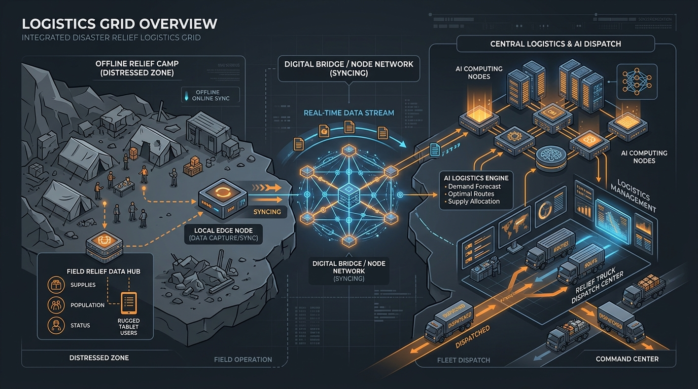
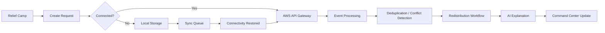
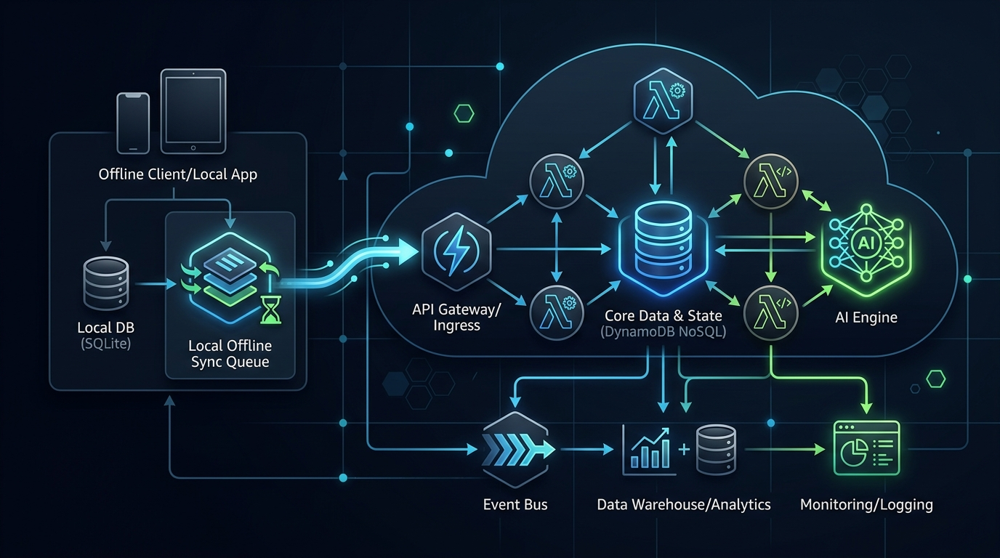
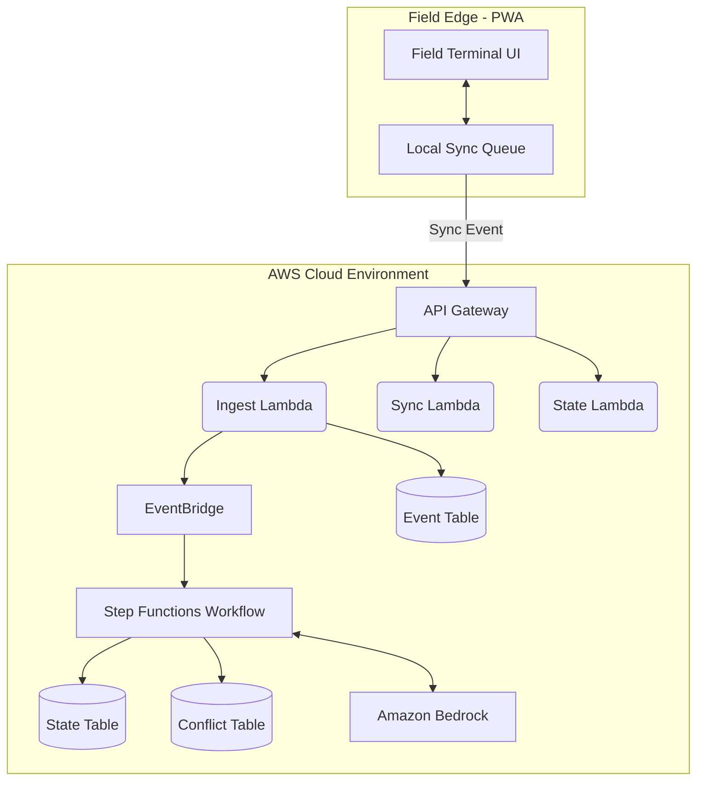
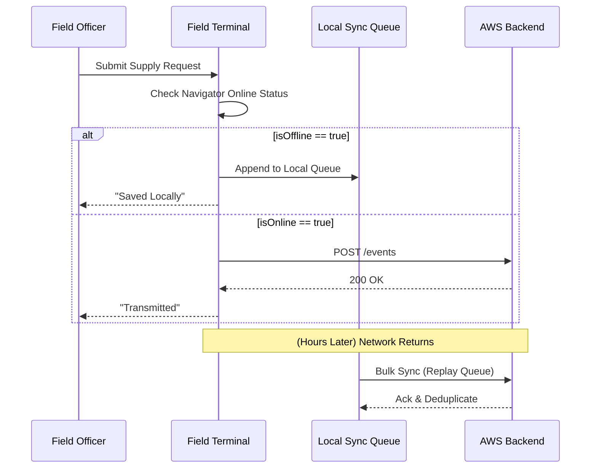

<div align="center">
  
  
  <br />
  
  <h1>🌉 SETU-DISASTER</h1>
  
  <p><b>When connectivity breaks, relief shouldn't.</b></p>
  <p>Offline-Tolerant Crisis Logistics & Last-Mile Ration Dispatch Grid</p>

  <div>
    
    
    
    
    
    
  </div>

  <br />
</div>

## 🚨 The Problem

In the immediate aftermath of a natural disaster, **communication infrastructure is the first to fail**. 
Relief camps rely on centralized coordination systems to request supplies (food, water, medicine). However, when camps lose connectivity, requests are dropped, operations stall, and command centers lose visibility into critical shortages. When connectivity briefly returns, panicked staff often submit duplicate requests, causing conflicting supply data and misallocated logistics. Existing dispatch systems assume a stable 4G/5G connection—an assumption that fails during every major crisis.

## 💡 The Solution

**SETU** (Sanskrit for *Bridge*) is an offline-first disaster logistics grid designed for zero-connectivity environments. Setu allows relief camps to continue operating completely offline. Through a ruggedized Field Terminal PWA, staff can log supply drops, request rations, and track inventory. All transactions are queued locally. The moment a sporadic network connection returns, Setu’s sync engine reliably transmits the queue, resolves duplicate events, and leverages Amazon Bedrock to explain and validate deterministic supply allocations, giving Command Centers perfect visibility into the chaos.

---

## 📑 Table of Contents
- [How Setu Works](#-how-setu-works)
- [Key Features](#-key-features)
- [Business Value](#-business-value--why-adopt-setu)
- [Scalability](#-scalability)
- [System Architecture](#️-system-architecture)
- [Offline-First Architecture](#-offline-first-architecture)
- [Event Synchronization](#-event-synchronization)
- [Conflict Resolution](#-conflict-resolution)
- [AI Dispatch Engine](#-ai-dispatch--decision-explanation)
- [AWS Services](#️-aws-services)
- [Data Flow](#-data-flow)
- [Product Walkthrough](#️-product-walkthrough)
- [Technology Stack](#-technology-stack)
- [Project Structure](#-project-structure)
- [Getting Started](#-getting-started)
- [Quick Commands](#-quick-commands)
- [Future Scope](#-future-scope)
- [License](#-license)

---

## 🔄 How Setu Works

Setu isolates the fragile network layer from the operational workflow, ensuring users are never blocked by a "No Internet" screen.



## 🎯 Key Features

| Feature | Description |
|---|---|
| 📴 **Offline Camp Terminal** | Field staff can log requests and inventory without internet access. |
| 💾 **Local Persistence** | Critical events are queued safely in the browser's IndexedDB/localStorage. |
| 🔄 **Event Synchronization** | Queued events are automatically transmitted upon network restoration. |
| 🧬 **Deduplication** | Idempotent event handling prevents panic-driven duplicate requests. |
| 🤖 **AI Decision Support** | Amazon Bedrock generates human-readable explanations for complex supply allocations. |
| 📦 **Inventory State** | Deterministic calculations to track camp survival windows based on current supplies. |
| 📊 **Command Center** | A high-visibility dashboard for logistics coordinators to monitor isolated camps. |

---

## 💼 Business Value & Why Adopt SETU

### Why Governments (FEMA, NDRF) & NGOs Need SETU
Current disaster management solutions are fundamentally broken because they rely on cloud-first architectures that become useless during blackouts. **SETU guarantees operational continuity.**

1. **Saves Lives Through Accurate Logistics:** Eliminates data loss during connectivity dropouts, ensuring critical supplies are accurately routed to camps with the shortest survival windows rather than just the camps with the loudest connectivity.
2. **Prevents Wastage & Misallocation:** By eliminating duplicate requests (deduplication) and deterministically balancing inventory across the grid, organizations save millions in misrouted supplies and spoiled perishables.
3. **Reduces Chaos and Training Overhead:** The AI advisory layer (Amazon Bedrock) translates complex redistribution math into plain English. Command Center operators don't need to be data scientists to understand *why* a shipment was rerouted.
4. **Zero-Installation Deployment:** As a Progressive Web App (PWA), Field Officers don't need to download large binaries from App Stores over congested 2G networks. They simply load the URL once, and it caches locally forever.

---

## 📈 Scalability

SETU is architected on a fully serverless, highly-scalable AWS backbone, ensuring it handles sudden spikes in traffic when regions regain connectivity simultaneously.

- **Serverless Compute:** AWS Lambda scales instantly from 0 to 10,000+ concurrent requests. When a major cell tower comes back online and 500 camps sync their offline queues concurrently, SETU digests the burst without dropping a single event.
- **Event-Driven Asynchrony:** API Gateway offloads events to Amazon EventBridge and Step Functions. This asynchronous decoupling prevents API timeout errors and ensures heavy conflict-resolution workloads don't block the UI sync engine.
- **High-Throughput State:** Amazon DynamoDB provides single-digit millisecond latency for the `EventTable` and `StateTable`, handling massive read/write scales deterministically.
- **Stateless Frontend:** The Next.js frontend deployed via AWS Amplify scales infinitely on the CDN edge, requiring zero manual server provisioning.

---

## 🏗️ System Architecture

<div align="center">
  
</div>



---

## 📴 Offline-First Architecture

Setu’s resilience lies in separating the **intent** of an action from its **transmission**. 
When a camp officer submits a ration request, the PWA intercepts the network state. If offline, the event is immediately pushed to a persistent local array and the UI reflects a "Queued Locally" success state. 



## 🔄 Event Synchronization & Conflict Resolution

When connectivity returns, the local sync layer flushes the pending event queue to the cloud.

1. **Event Creation:** Every action generates an immutable `Event` object with a unique UUID.
2. **Local Persistence:** Uses browser storage to survive tab closures and device reboots.
3. **Queueing & Retry:** Unacknowledged events remain in the queue. 
4. **Deduplication:** The `IngestEvent` Lambda checks the `EventTable`. If an event ID already exists, it is ignored, preventing double-dispatching when anxious users spam the submit button.
5. **Conflict Handling:** The Step Functions workflow executes `DetectConflicts` to verify if a requested allocation exceeds the available warehouse inventory, prioritizing camps based on their critical survival window (< 6 hours).

---

## 🤖 AI Dispatch & Decision Explanation

While the core reallocation math is strictly deterministic (prioritizing camps by `survivalWindowHours`), the resulting logic can be difficult for human coordinators to parse rapidly in a crisis. 

**Amazon Bedrock Integration:**
- **Trigger:** The Step Functions workflow invokes the `ExplainDecision` Lambda.
- **Input:** JSON payload of the conflict, the available inventory, and the deterministic reallocation result.
- **Output:** A concise, natural-language explanation of *why* the system made that decision (e.g., *"Camp Alpha's request for 2000L of water was partially fulfilled with 1000L because their survival window is 3 hours, overriding Camp Bravo's request."*).
- **Execution:** Bedrock **does not** execute logistics commands directly; it acts strictly as an advisory explanation engine for the human-in-the-loop Command Center.

---

## ☁️ AWS Services

| AWS Service | Role in Setu | Implementation |
|---|---|---|
| **Amazon Bedrock** | AI explanation | Uses `anthropic.claude-3-haiku-20240307-v1:0` to explain complex redistribution algorithms. |
| **AWS Lambda** | Serverless compute | Multiple TS functions: `ingestEvent`, `detectConflicts`, `explainDecision`. |
| **Amazon DynamoDB** | Operational state | `EventTable`, `StateTable`, `ConflictTable`, `RecommendationTable`. |
| **Amazon API Gateway** | API layer | REST HTTP API for ingress and WebSocket API for real-time broadcasts. |
| **AWS Step Functions** | Workflow | Express State Machine orchestrating the conflict/reallocation pipeline. |
| **Amazon EventBridge** | Event router | `SetuEventBus` triggers the Step Functions workflow on new critical events. |
| **AWS Amplify** | Hosting | Hosts the globally accessible Next.js frontend application. |

---

## 📊 Data Flow

The CDK implementation provisions specific DynamoDB tables that manage the lifecycle of a disaster response:
- **EventTable:** Immutable append-only log of every supply request and status update.
- **StateTable:** Aggregated, current operational state of all camps and warehouses.
- **ConflictTable:** Records instances where demand exceeds available supply.
- **RecommendationTable:** Stores the Bedrock-generated explanation alongside the deterministic reallocation.

---

## 🖥️ Product Walkthrough

### 01 — Landing / Overview
The unified entry point providing access to the Command Center and the Field Terminal (simulating different physical devices).

### 02 — Field Terminal 
A ruggedized interface tailored for Camp Officers and Warehouse Drivers. Large buttons and clear typography optimized for high-stress environments.

### 03 — Offline Mode Simulation
Users can manually toggle a "SIMULATE DISCONNECT" button to isolate the terminal. Requests made in this mode instantly queue locally, displaying a pending count without blocking the user.

### 04 — Command Center Dashboard
Logistics Coordinators view the global state. When the Field Terminal reconnects, the Command Center instantly reflects the synchronized events securely fetched from AWS via WebSocket broadcasts.

---

## 💻 Technology Stack

| Layer | Technology |
|---|---|
| **Frontend UI** | Next.js 15, React 19, TailwindCSS |
| **Language** | TypeScript |
| **Local State** | React Context, IndexedDB, `localStorage` |
| **IaC** | AWS CDK |
| **Compute / API** | AWS Lambda, API Gateway |
| **Database** | Amazon DynamoDB |
| **Workflow** | AWS Step Functions, EventBridge |
| **AI** | Amazon Bedrock (Claude 3 Haiku) |

---

## 📂 Project Structure

```text
SETU-Crisis-Logistics-Grid/
├── backend/                  # AWS Infrastructure & Compute (CDK)
│   ├── bin/                  # CDK App Entrypoint
│   ├── lambda/               # Serverless Handlers (Ingest, Bedrock, etc)
│   ├── lib/                  # CDK Stack Definitions
│   └── test/                 # Backend unit tests
├── frontend/                 # Next.js Application
│   ├── src/app/              # Next.js App Router Pages
│   │   ├── command/          # Coordinator Dashboard
│   │   ├── field/            # Offline-capable Terminal
│   │   └── page.tsx          # Landing
│   ├── src/components/       # UI Elements
│   └── src/lib/              # State & Sync Logic
├── shared/                   # Shared types, constants, and deterministic logic
└── docs/                     # Images and Architecture diagrams
```

---

## 🚀 Getting Started

### Prerequisites
- Node.js >= 20
- npm or pnpm
- AWS CLI & CDK bootstrapped account to deploy the backend.

### Quick Setup

```bash
git clone https://github.com/vaibhavvvvjain03/SETU-Crisis-Logistics-Grid.git
cd SETU-Crisis-Logistics-Grid/frontend

# Install dependencies
npm install

# Start development server
npm run dev
```

Navigate to `http://localhost:3000` to launch the application locally.

---

## ⚡ Quick Commands

| Command | Purpose |
|---|---|
| `npm run dev` | Start the local Next.js development server. |
| `npm run build` | Build the frontend for production. |
| `npm run start` | Start the production frontend server. |
| `npm run lint` | Run ESLint checks. |

*(For the backend CDK deployment, navigate to `backend/` and use `npm run build`, `npm run test`, and `npx cdk deploy`)*

---

## 🎬 Demo Scenario: Flash Flood Isolation

1. **09:00** — Open the Command Center in Tab A. 
2. **09:05** — Open the Field Terminal in Tab B. Click **SIMULATE DISCONNECT**.
3. **09:10** — Camp Alpha creates an urgent request for 2000L of water.
4. **09:12** — The request is stored in the local offline queue. The Command Center (Tab A) remains unaware.
5. **09:20** — Camp Alpha clicks **RECONNECT**.
6. **09:21** — Setu immediately flushes the queue to the AWS API Gateway.
7. **09:22** — The AWS WebSocket API pushes an update to the Command Center (Tab A), instantly populating the new event in the Event Stream and updating the supply state.

---

## ✅ Implementation Status

| Component | Status |
|---|---|
| **Offline PWA / Sync Queue** | ✅ Implemented (IndexedDB & Background Sync) |
| **AWS Lambda** | ✅ Implemented & Deployed (CDK Stack) |
| **Amazon DynamoDB** | ✅ Implemented & Deployed (CDK Stack) |
| **AWS Step Functions** | ✅ Implemented & Deployed (CDK Stack) |
| **Amazon API Gateway** | ✅ Implemented & Deployed (REST + WebSocket) |
| **Amazon Bedrock Integration** | ✅ Implemented & Deployed (Claude 3 Haiku) |
| **AWS Amplify Hosting** | ✅ Implemented & Deployed (Live UI) |

---

## 🔮 Future Scope

- **Mesh Networking:** Allow offline Field Terminals to sync with *each other* via Bluetooth/Local Wi-Fi mesh before reaching the cloud.
- **Satellite Integration:** Low-bandwidth fallback endpoints specifically optimized for Starlink or satellite modems.
- **Predictive Demand Forecasting:** Using Bedrock to predict supply shortages *before* they occur based on weather event telemetry.
- **Government Integration:** Standardized webhooks to automatically forward dispatch requests to FEMA or local equivalents.

---

## 👥 Team
- **Vaibhav A Jain** - Developer

---

## 📄 License

This project is licensed under the [MIT License](LICENSE). See the LICENSE file for more details.

---

<div align="center">
  <p><i>Disasters don't wait for connectivity.</i></p>
  <p><b>Setu is built so relief coordination doesn't have to either.</b></p>
</div>
